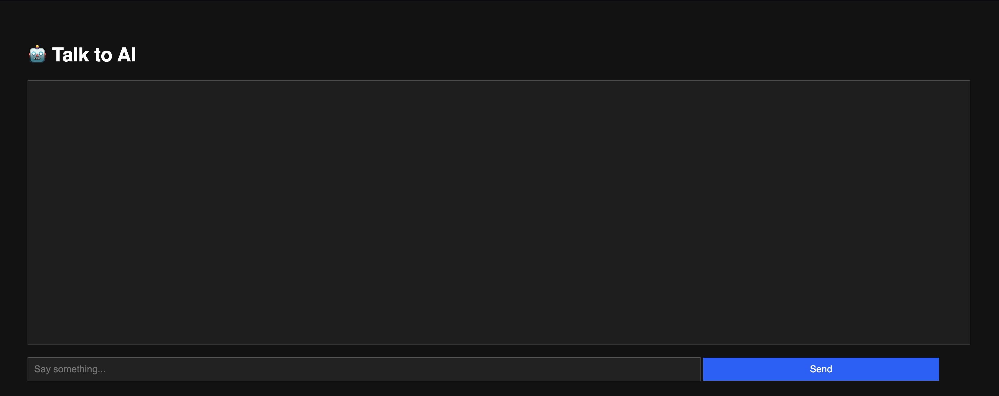

# 🤖 Beginner-Friendly AI Chatbot



A simple AI-powered chatbot built using Flask and OpenAI's GPT API. Designed to be beginner-friendly with a clean UI and easy setup.

---

## 🚀 Features

- Chat with an AI assistant using GPT-3.5
- Clean, modern dark mode UI
- Beginner-friendly codebase
- Responsive design
- Easy deployment

---

## 🧠 Tech Stack

- Python
- Flask
- HTML/CSS
- JavaScript (Fetch API)
- OpenAI GPT (via API)

---

## 🔧 Setup Instructions

1. **Clone the Repository**
   ```bash
   git clone https://github.com/zlk1l/ai-chatbot.git
   cd ai-chatbot
